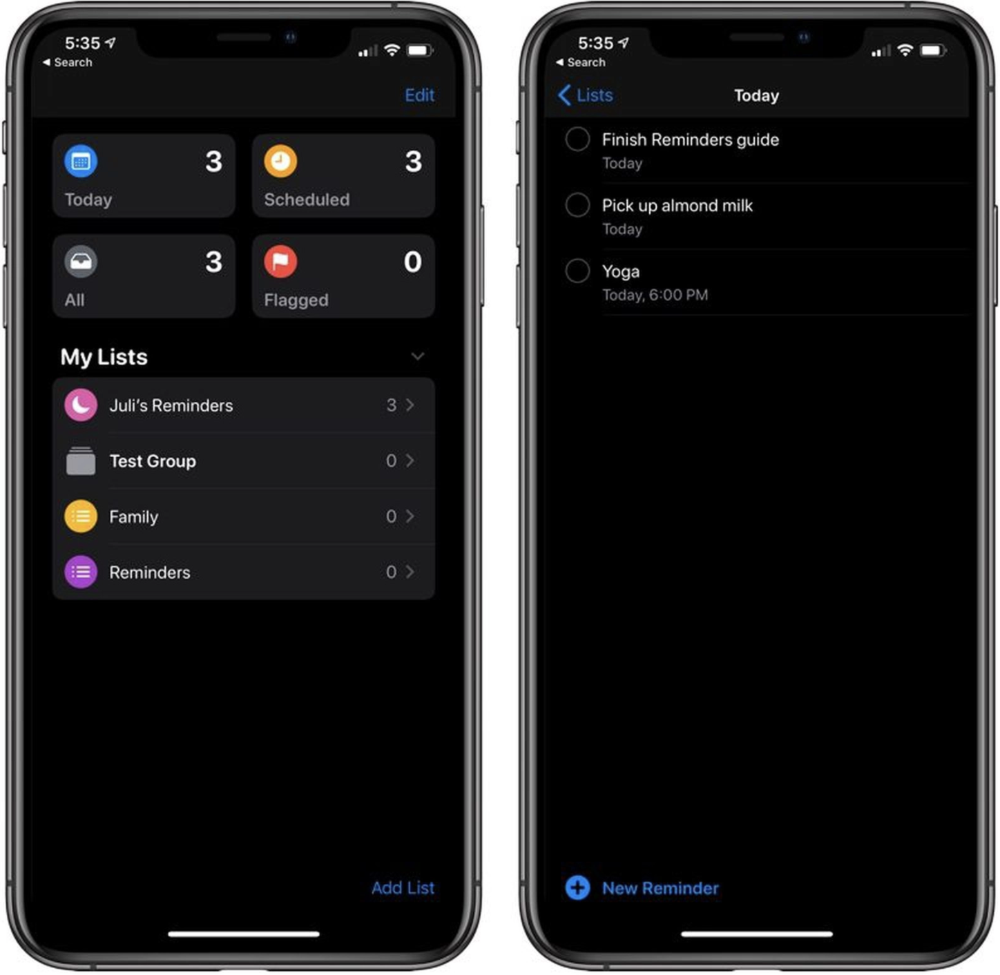
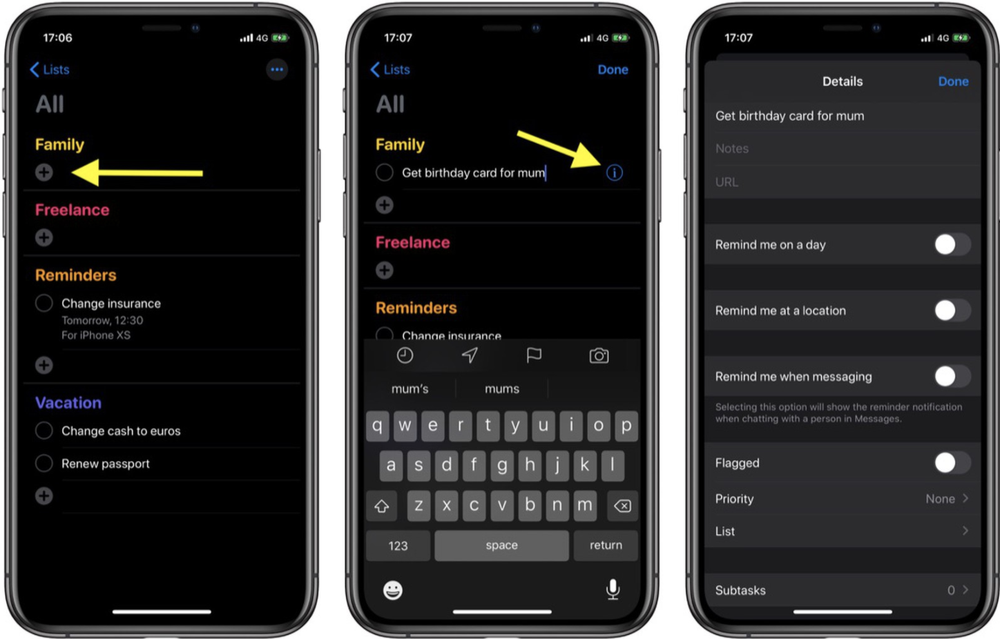

# 백엔드 개발자 채용 부문 기술 과제

### 개요

미리 알림 앱에서 쉽게 미리 알림을 생성하고 구성하여 살면서 해야 할 일들을 파악할 수 있습니다. 쇼핑 목록, 업무상의 프로젝트, 집안일 및 관리하고자 하는 모든 것에 대해 사용할 수 있습니다. 하위 작업을 생성하고, 깃발을 설정하고, 첨부 파일을 추가하고, 언제 어디서 미리 알림을 받을지 선택할 수 있습니다. 또한 스마트 목록을 사용하여 미리 알림을 자동으로 구성할 수 있습니다.

### 디자인

Today, Scheduled, All, Flagged 등의 보기 덕분에 My Lists 의 목록에 등록된 미리 알림을 더 효과적으로 확인 할 수 있습니다. 예를 들어 Today 보기를 선택했다면, 오늘 해야 할 일들에 대해서 My Lists 에 등록된 미리 알림이 표시 될 것 입니다. 혹은, All 보기를 선택했다면, My Lists 의 모든 미리 알림이 표시 될 것 입니다. 

### 미리 알림 항목 관리

필요하다고 생각하는 만큼 미리 알림을 만들고 My Lists 의 목록에 등록할 수 있습니다. 
예를 들어 All 보기를 선택하면 화면에서 새 미리 알림을 등록할 수 있는 더하기 + 버튼이 있습니다. 등록된 미리 알림 항목 왼쪽의 빈 동그라미 버튼을 선택하여 완료 상태로 변경하여 목록에서 표시 되지 않도록 제거 할 수 있습니다. 미리 알림 항목 옆에 작은 정보 ⓘ 버튼을 선택하여 미리 알림에 메모를 추가하고, 특정 날짜 및 특정 위치에서 미리 알림을 받도록 선택하고, 우선 순위를 지정하는 등의 작업을 수행할 수 있습니다.  수정을 완료하려면 Details 화면의 오른쪽 상단 모서리에 있는 Done 을 선택 합니다.

### 구현 목표

1. 가상 키보드 입력이 끝났을 때 미리 알림을 등록하기 위한 RESTful API 를 구현 하세요.

   > Request Body 데이터 형식 예

   | 데이터 이름 | 데이터 형식 |
   | ----------- | ----------- |
   | Title       | string      |

   

2. Details 화면에서 상세내역을 입력하고 Done 을 선택하면 미리 알림이 수정되도록 RESTful API 를 구현 하세요.

   > Request Body 데이터 형식 예

   | 데이터 이름        | 데이터 형식                            |
   | ------------------ | -------------------------------------- |
   | Title              | string                                 |
   | Memo               | string                                 |
   | URL                | string                                 |
   | Remind me on a day | Date                                   |
   | Repeat             | 안함, 매시간, 매일, 매주, 매월, 매년   |
   | Flagged            | boolean                                |
   | Priority           | 없음, 낮음, 중간, 높음                 |
   | My Lists           | Family, Freelance, Reminders, Vacation |

   

3. 미리 알림을 완료 상태로 변경하기 위한 RESTful API 를 구현 하세요. 

   > 완료 상태를 미완료 상태로 변경하기 용이하도록 동일한 엔드포인트를 제공 합니다. 예를 들어 처음 API 를 호출 했을 때는 완료 상태로 변경 되지만, 다시 API 를 호출 했을 때는 미완료 상태로 변경 됩니다.

### 참고 사항

- Node.js 기반의 RESTful API 서비스를 구현합니다.
- 데이터베이스를 사용하지 않고, JSON 배열 형태의 목업 데이터를 임시로 사용 합니다. 테스트를 위해서 적어도 5개 아이템 정도는 미리 정의해 주세요.
- 최종 결과물은 개인 GitHub Repository 에 저장하여 URL 을 회신해 주세요.
- 이 외에 라이브러리 사용 및 설계/구현 방식은 개인의 판단에 맞게 자유롭게 진행하세요.
